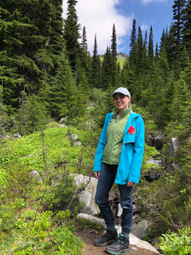

## Time Spent Outside of Tech

What do I enjoy doing when I'm not programming or binge gaming? I enjoy getting outside and going for a hike. The PNW is full of opportunities to get out and see nature. The climate out here makes it convenient to do any time of the year. 

My most recent hike took place at [Mount Rainier](https://www.nps.gov/mora/index.htm). My husband and I drove up to the [Paradise Area](https://www.nps.gov/mora/planyourvisit/paradise.htm) to hike the 5.5 mile long Skyline Loop Trail. It took us 5 hours to complete and our highest elevation was 7,051'. It was the most demanding hike we had done and by far the most beautiful one. The landscape their looked unreal and the photos of it looked like they had been photoshopped. 

[Back to Home](README.md)